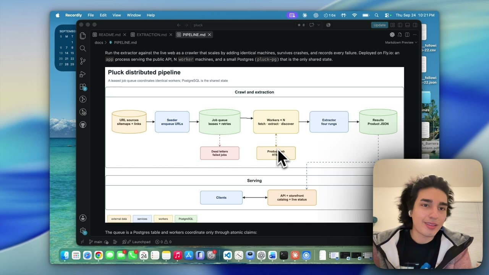
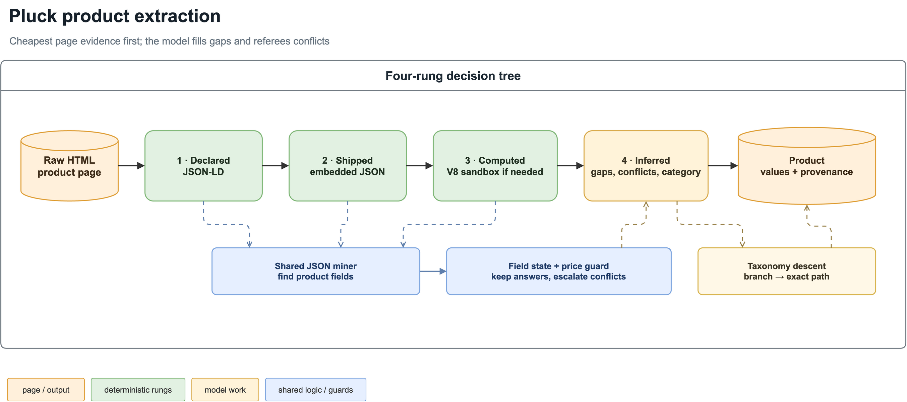
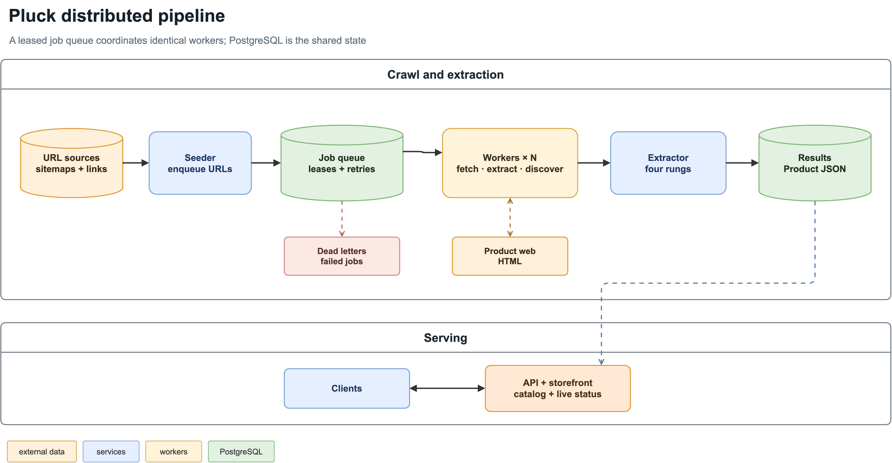

# pluck

Extract product data (name, price, compare-at, currency, category, brand, description, variants, images) from any product page. One decision tree: the page's own data answers first, a model only speaks when the page can't.

It is deployed. Try any product URL:

```bash
curl -X POST https://pluck-extract.fly.dev/extract \
  -H 'content-type: application/json' \
  -d '{"url": "https://www.brooklinen.com/products/luxe-core-sheet-set"}'
```

Or browse the storefront it feeds: [pluck-extract.fly.dev](https://pluck-extract.fly.dev) has the assignment's 50 pages, the original 5, a live-crawled catalog, and a live view where you can run, pause, cap, or clear the crawl and feed it single urls.

## Demo

[](https://www.youtube.com/watch?v=blkHG3OnneM)

*Click to watch the walkthrough on YouTube.*

## Goal and how it works

Most product pages already contain the answer in machine-readable form. Pluck climbs four rungs, cheapest first, and stops as soon as the core fields (name, price, currency) are filled:

1. **declared** - JSON-LD blocks the merchant wrote for Google. Free, exact.
2. **shipped** - JSON state frameworks embed as inert script tags (`__NEXT_DATA__` and friends). Free.
3. **computed** - run the page's own inline JS in a V8 sandbox and read the state it builds. Free, catches Shopify-style pages that build state at runtime.
4. **inferred** - one small LLM call over the cleaned page text for whatever is still missing.



Two sanity checks sit on top:

- A price pulled from page data has to show up on the rendered page too. If the JSON says 299.95 but the page displays 279.95, something is stale and the price goes to the model with the page text. Same when two sources give different numbers.
- Category never exists on a page, so the model always answers it. To stop it from making up categories, it first picks one of the 21 top-level branches, then picks from a list of every real path under that branch.

Example, a Shopify robe page with no JSON-LD offers: rung 1 gets the name, rungs 1-2 have no price, rung 3 runs the page's scripts and finds `price: 8940` in cents (89.40), the price shows on the page so it sticks, and the model handles category plus the feature list. Total for the page: three sub-cent calls.

The full mechanism, with real inputs and outputs at every step: [docs/EXTRACTION.md](docs/EXTRACTION.md).

## The distributed pipeline

The deployed system is a crawler x extractor with real big-data mechanics, run at demo scale:



- It all runs on [Fly.io](https://fly.io): one Docker image, two process groups (`app` serves the api and storefront, `worker` crawls), a small Fly Postgres as the only shared state, and secrets kept in Fly instead of the image. `fly deploy` ships both groups; `fly scale count worker=N` is the throughput dial.
- Workers coordinate only through atomic claims (`FOR UPDATE SKIP LOCKED`); duplicates are impossible by construction (`url` is unique, inserts are `ON CONFLICT DO NOTHING` on normalized urls).
- Measured scaling: 9 pages/min at 1 worker, 21 at 4 (sublinear because the work is llm and network bound, not cpu), changed with one command (`fly scale count worker=4`); the deployment runs 4. A worker did freeze mid-crawl once; its leased pages were reclaimed automatically and nothing was lost.
- The live view drives it all: rerun the default stores or a single url, pause and resume the fleet, cap the frontier with max pages, and clear the live catalog (the assignment batches always survive).
- At 50M products the shape stays the same and the parts grow: partitioned job/result storage, per-domain rate-limit coordination, a headless-browser fetch tier for the stores that ship empty HTML, and re-crawl scheduling off the `processed_at` column that already exists.

Queue mechanics, worker lifecycle and ops commands: [docs/PIPELINE.md](docs/PIPELINE.md).

## Results

Against the 50-page eval set, graded against the previous pipeline's manually spot-checked outputs:

| field | pluck (flash-lite) | pluck (gemini-3-flash) | previous pipeline |
|---|---|---|---|
| name | 96% | 96% | ~98% |
| price | 96% | 96% | ~96% |
| compare-at | 90-94% | 92% | ~94% |
| currency | 100% | 100% | - |
| category | 82% | 92% | 96% |
| cost per 1K pages | ~$1.30 | ~$6 | $20 |
| code | ~880 lines | same | ~2,400 lines |

Measured in production (311 live pages, 18 stores, one crawl):

- **$0.71 per 1K pages** (actual OpenRouter billing), extraction latency p50 1.5s / p95 2.5s (fetching the page adds more)
- name resolved free on 100% of pages, currency 83%, price 72%; category always uses the model by design
- 77% fetch success; failures are bot-walled stores, each dead-lettered with its reason

## Benchmarks

Ablations over the 50 verified pages, both models (correct counts out of 50):

| config | name | price | compare-at | currency | category |
|---|---|---|---|---|---|
| full tree, flash-lite | 48 | 48 | 45 | 50 | 41 |
| full tree, gemini-3-flash | 47 | 47 | 46 | 49 | 45 |
| naive one-call, flash-lite | 42 | 42 | 47 | 43 | 25 |
| naive one-call, gemini-3-flash | 44 | 44 | 46 | 48 | 33 |
| no v8 sandbox rung (lite) | 47 | 48 | 45 | 50 | 41 |
| no visible-price check (lite) | 48 | 46 | 45 | 50 | 40 |

The sandbox rung barely moves this static set (the model fallback catches those pages) but earns its keep live, answering name and price free on the third of the crawl that ships code instead of data. The naive gap shrinks as the model gets stronger, so the tree matters most exactly where it saves the most money: it is what makes the cheap model viable.

Live throughput: 9 pages/min at 1 worker, 21 at 4, 57 peak at 8. A spot check of 30 random live-crawled products (judged by a stronger model against freshly fetched pages) held at 87-100% per field.

Back-of-envelope scaling from the measured numbers (one worker sustains ~390K pages/month at $5.70/mo):

| scale | workers | infra | llm (flash-lite) |
|---|---|---|---|
| 1M pages/mo | 3 | ~$40/mo | ~$710/mo |
| 50M pages/mo | ~130 | ~$800/mo | ~$35K/mo |

LLM spend dominates at scale, which is the argument for the free rungs.

## Running it

```bash
uv sync                                  # deps
uv run python main.py                    # hydrate the schema from data/*.html -> output/
uv run python eval.py                    # 50-page accuracy eval (needs the graded set, see eval.py)
uv run uvicorn pipeline.api:app --port 8080       # the api, locally
DATABASE_URL=... python -m pipeline.seed          # seed the queue
DATABASE_URL=... python -m pipeline.worker        # a worker
cd frontend && npm install && npm run build       # the storefront the api serves
```

`PLUCK_MODEL` picks the model for all calls: `google/gemini-2.5-flash-lite` (default, cheapest) or `google/gemini-3-flash-preview` (category 82% -> 92% at ~6x the LLM cost).
